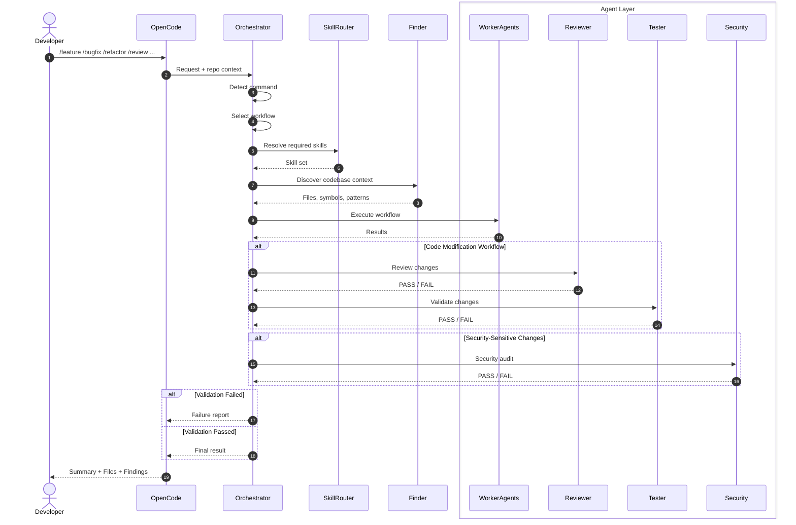
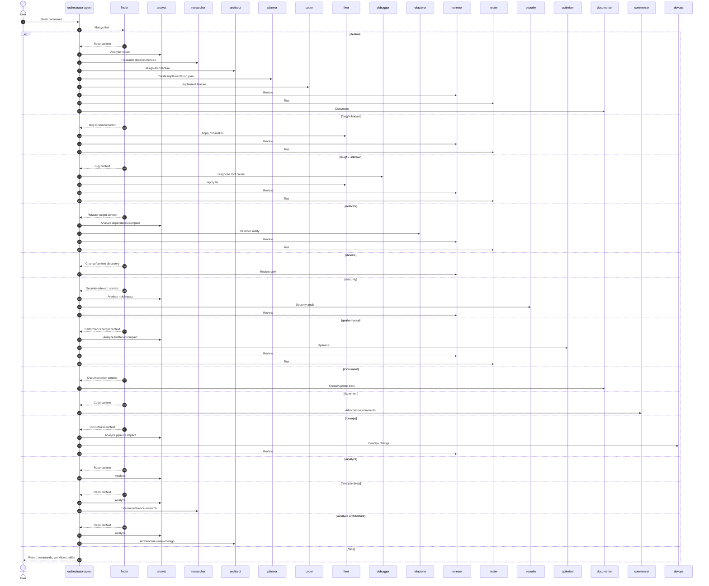
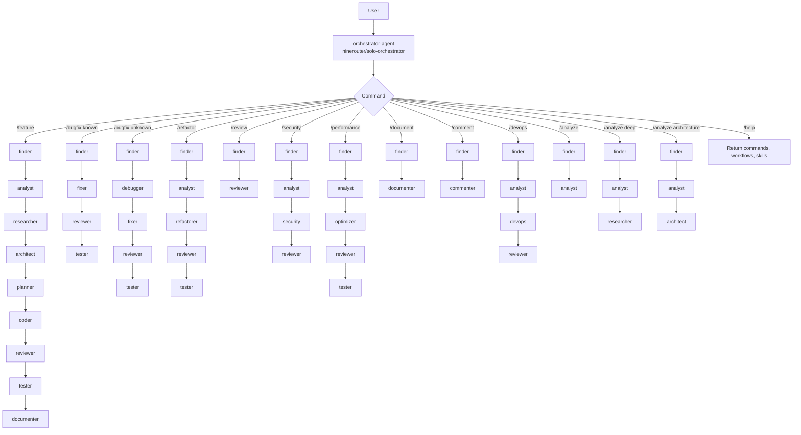
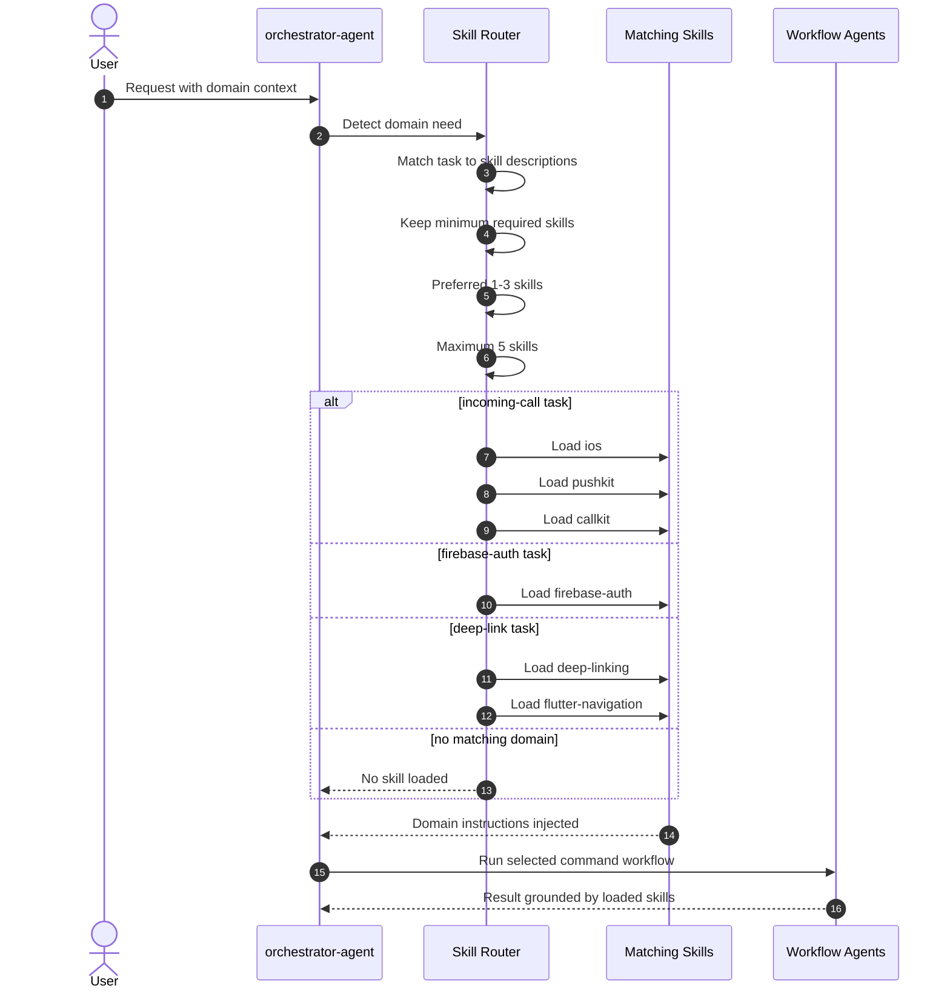
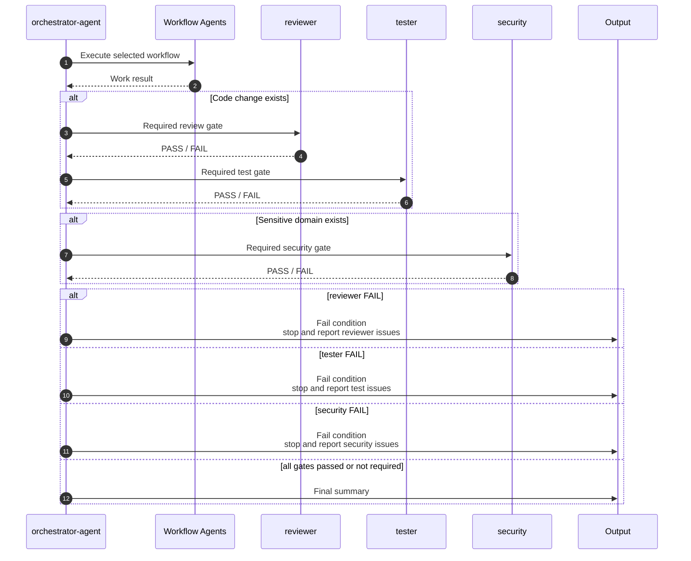
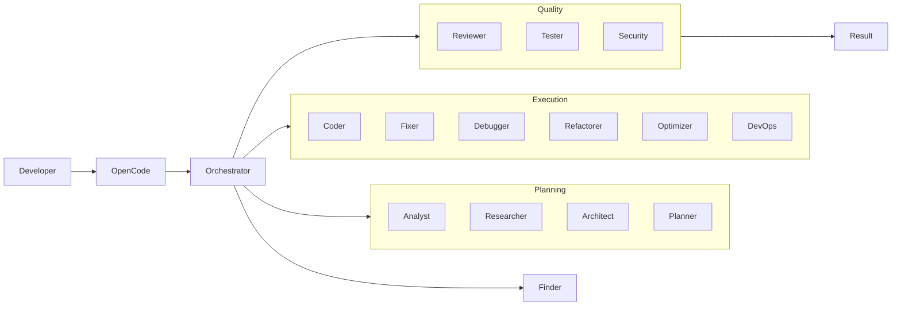

# OpenCode Agent Workflows

This document contains sequence diagrams and flowcharts explaining the OpenCode multi-agent orchestration system, command workflows, and agent routing used in this project.

## Table of Contents

- [Overall Orchestrator Flow](#overall-orchestrator-flow)
- [Command Workflow Router](#command-workflow-router)
- [Available Command Workflows](#available-command-workflows)
- [Skill Routing Sequence](#skill-routing-sequence)
- [Gate Handling Flow](#gate-handling-flow)
- [Agent Categories](#agent-categories)
- [Presentation Notes](#presentation-notes)

---

## Overall Orchestrator Flow

This diagram shows the high-level flow from user command to final output, including skill routing and gate handling.

---

## Command Workflow Router

This diagram shows how each slash command is routed to its specific agent workflow sequence.

---

## Available Command Workflows

This flowchart shows all available slash commands and their corresponding agent workflows.

---

## Skill Routing Sequence

This diagram shows how the orchestrator loads domain-specific skills based on the task context.

---

## Gate Handling Flow

This diagram shows how quality gates (reviewer, tester, security) control workflow completion.

---

## Agent Categories

This flowchart organizes all available agents by their role categories.

---

## Presentation Notes

### Key Points

- **`orchestrator-agent`** is the central routing coordinator
- User interacts via **slash commands** (`/feature`, `/bugfix`, `/refactor`, etc.)
- **`finder`** always runs first in every workflow
- Workflow is selected from command mapping
- **Skills** are loaded only when domain matches task context
- Code changes **must pass** `reviewer` + `tester` gates
- Sensitive domains **must pass** `security` gate
- If `reviewer`, `tester`, or `security` returns `FAIL`, workflow stops immediately

### Output Format

Every workflow returns:

- `command` - slash command used
- `workflow` - agent sequence executed
- `skills` - domain skills loaded
- `summary` - task result
- `files changed` - modified files
- `review` - review gate result
- `test` - test gate result
- `security` - security gate result

### Agent Models (9Router)

| Agent Category | Model ID |
| --- | --- |
| Orchestrator | `ninerouter/solo-orchestrator` |
| Research (fast) | `ninerouter/researcher-fast` |
| Research (deep) | `ninerouter/researcher-deep` |
| Implementation (low) | `ninerouter/implementation-low` |
| Implementation (high) | `ninerouter/implementation-high` |
| Quality (high) | `ninerouter/quality-high` |
| Quality (safer) | `ninerouter/quality-safer` |
| Infrastructure (low) | `ninerouter/infrastructure-low` |
| Infrastructure (high) | `ninerouter/infrastructure-high` |
| Documentation | `ninerouter/documentation-low` |

### Available Commands

| Command | Purpose |
| --- | --- |
| `/feature` | Full feature implementation workflow |
| `/bugfix` | Bug fix workflow (known or unknown) |
| `/refactor` | Safe refactoring workflow |
| `/review` | Code review only |
| `/security` | Security audit workflow |
| `/performance` | Performance optimization workflow |
| `/document` | Documentation creation/update |
| `/comment` | Add inline code comments |
| `/devops` | CI/CD and deployment workflow |
| `/analyze` | Repository analysis (standard/deep/architecture) |
| `/help` | Show available commands and workflows |
